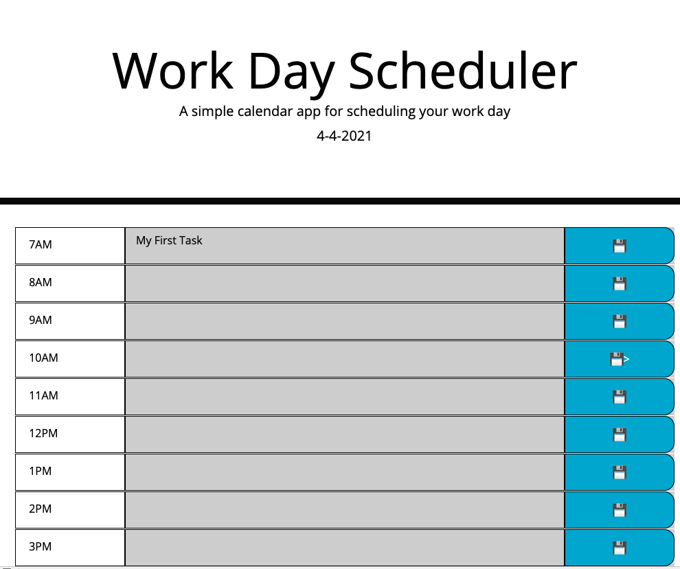

# workday-scheduler
## Weekly Challenge Work Day Scheduler Intro
- A simple calendar application that allows a user to save events for each hour of the day. 
This app will run in the browser and feature dynamically updated HTML and CSS powered by jQuery.
### Link to deployed application on GitHub Pages
* https://github.com/Likica/workday-scheduler/deployments/activity_log?environment=github-pages

## This is landing page for workday-scheduler

* Title with current date displayed

* Task area where user can enter their daily task in apppropriate slot for the time of their work day and save the task

## Contribution
Made with ❤️ by Fahrija Wyroski